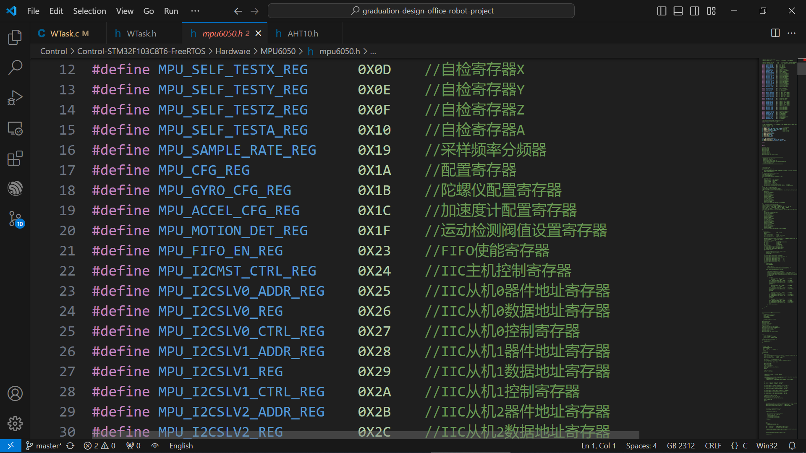

<h1 align = "center">GCC&MakeFile先修知识</h1>  
>**目录📔**
>[toc]

# 1. 计算机程序编译流程 💻

> [!TIP]
>众所周知，计算机编译程序是将高级语言翻译成汇编语言，然后再将汇编语言翻译成计算机能理解的机器语言也就是二进制数据


## 1.1 预处理🔌


> **预处理说白了就是将C语言中宏进行替换，就像下边的宏在这样，在代码中调用宏的位置直接替换**


<div style="border-radius: 10px; overflow: hidden; box-shadow: 5px 5px 5px #888888;">
    
</div>


## 1.2 编译🔨
<table><tr><td bgcolor=orange>编译：是将C语言这种高级语言，编译成汇编语言</td></tr></table>

>**编译这一步做的是将.c文件，变成汇编文件.s后缀的文件**


>**以下是C语言代码**
```c
#include <stdio.h>

int main(void) 
{
    printf("Hello, World!\n");
    return 0;
}
```
--- 
>**以下是汇编语言代码**
```assembly
ORG 0x0000        ; 程序的起始地址

MOV P0, #0x00     ; 初始化 P0 端口为输出，所有引脚置零
MOV P1, #0xFF     ; 初始化 P1 端口为输入，所有引脚置一

MAIN:
    MOV P0, #0x01 ; 点亮第一个LED
    CALL DELAY     ; 延时
    MOV P0, #0x00 ; 关闭第一个LED

    MOV P0, #0x02 ; 点亮第二个LED
    CALL DELAY     ; 延时
    MOV P0, #0x00 ; 关闭第二个LED

    MOV P0, #0x04 ; 点亮第三个LED
    CALL DELAY     ; 延时
    MOV P0, #0x00 ; 关闭第三个LED

    SJMP MAIN      ; 无限循环

DELAY:
    ; 简单的延时函数，具体时间根据实际需要调整
    MOV R2, #0xFF
DELAY_LOOP:
    DJNZ R2, DELAY_LOOP
    RET
```


## 1.3 汇编📲

> [!NOTE]  
> 汇编是将汇编语言翻译成计算机所能理解的机器语言也就是二进制  
>**汇编这一步做的是将汇编文件.s文件，变成目标文件.o文件**


## 1.4 链接📡

> [!NOTE]  
> **目标文件包含普通的.o文件和动态库文件.so文件以及静态库.a文件**
> **Windows系统中：**静态库文件是.lib后缀的，动态库文件是.dll，可执行文件.exe后缀的
> **Linux系统中：**静态库文件是.a后缀的，动态库文件是.so，可执行文件一般没后缀编译出来的为ElF格式的


---
## 总结😜
> [!TIP] 
> 1. 本文讲的比较浅显，仅仅是为了让你大概的了解不至于学gcc命令和makefile的时候不是很懵圈
> 2. 要想深入了解这类知识建议去看看韦东山的相关教程和正点原子Linux教程部分的东西还有网上其他大佬讲的这方面的知识点
> 3. 要博览网上的资源教程，然后进行个对比


