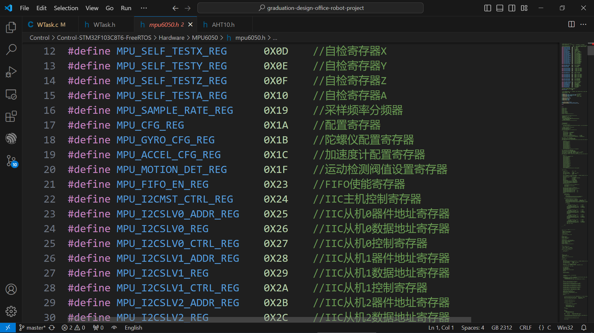
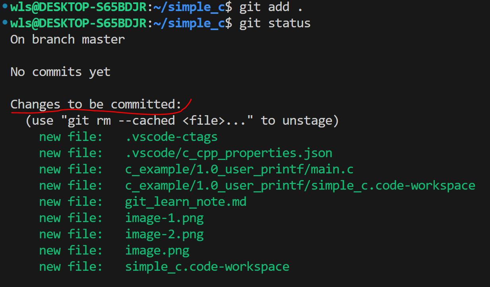
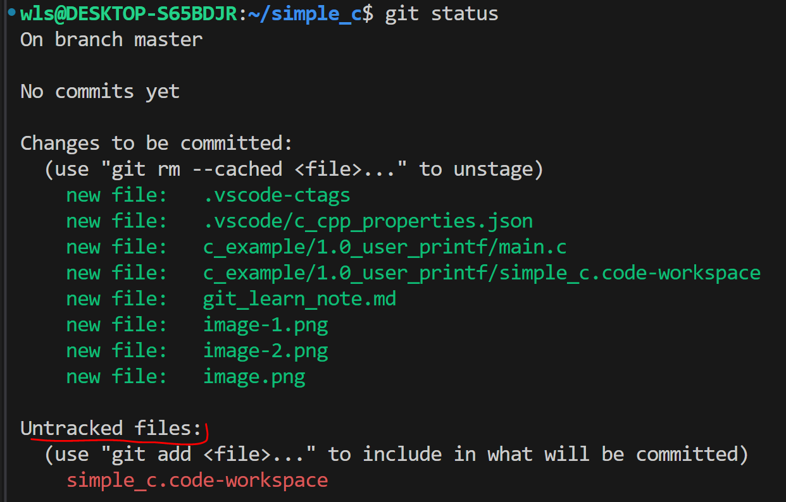

***---------------------Git Use Learn Note------------------------------***

## 1. Config User name and User Email
    1. git config --global user.name "wls"  //conifg git user name wls
    2. git config --global user.email ufo281@outlook.com  //conifg git user email 

## 2. Creat Git Repositories
    1. git init //use this command init current directory to git Repositories
    /* 仓库文件都存放在了 当前目录下的.git文件里  */

## 3. Git 添加 提交 工作原理流程图

> 

> 

> 

    1. git add . //将当前目录下的所有文件都添加到暂存区中，然后可以使用git status 查看下当前的状态
**如下图所示**
> 

> 

    2. git commit -m "v1.0" //把暂存区中的文件提交到本地仓库中去，此操作并不会把工作区中的文件提交到本地仓库中去
> 

## 4. Git 仓库状态查看
    1. git status  //查看仓库的修改状态 当前仓库处在什么分支，有哪些文件，文件处在什么状态

