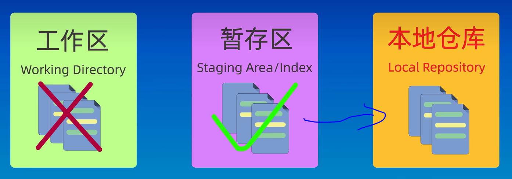

***---------------------Git Use Learn Note------------------------------***

## 1. Config User name and User Email
    1. git config --global user.name "wls"  //conifg git user name wls
    2. git config --global user.email ufo281@outlook.com  //conifg git user email 

## 2. Creat Git Repositories
    1. git init //use this command init current directory to git Repositories
    /* 仓库文件都存放在了 当前目录下的.git文件里  */

## 3. Git 添加 提交 工作原理流程图

> 

> 

> 

    1. git add . //将当前目录下的所有文件都添加到暂存区中，然后可以使用git status 查看下当前的状态
**如下图所示**
> 

> 


    2. git commit -m "v1.0" //把暂存区中的文件提交到本地仓库中去，此操作并不会把工作区中的文件提交到本地仓库中去
> 


    3. git log //查看git commit的提交记录，就是从从暂存区提交到本地仓库的提交记录
```
wls@DESKTOP-S65BDJR:~/simple_c$ git log     /*使用git log命令 产看commit记录*/
commit a9c1c7e319674f6c6f72aec637b3783503a09de8 (HEAD -> master)
Author: wls <ufo281@outlook.com>
Date:   Fri Apr 26 19:25:17 2024 +0800 /*commit 时间记录*/

    add image-3.png     /*commit提交时候的备注*/

commit fbd6c1152ffba03d7577eea2d066e7da3d8d782a /*commit 记录*/
Author: wls <ufo281@outlook.com>
Date:   Fri Apr 26 19:23:21 2024 +0800  /*commit 时间记录*/

    v1.0   /*commit提交时候的备注*/
```
    4. git log --oneline //查看详细版的提交 commit 历史 
```
wls@DESKTOP-S65BDJR:~/simple_c$ git log --oneline 
faf6c7e (HEAD -> master) new
6352ab1 git_learn_note.md
a9c1c7e add image-3.png
fbd6c11 v1.0
```


## 4. Git 仓库状态查看
    1. git status  //查看仓库的修改状态 当前仓库处在什么分支，有哪些文件，文件处在什么状态，未添加的，添加的，未提交的，提交的


## 5. git reset 回退到某个版本

    1. git reset --soft 6352ab1 // "6352ab1" 要回退版本的ID 输入 git log --oneline 查看获得，/*soft 只是回退到上个版本到那时取消之前的commit 提交到本地仓库的东西 */

    2. git reset --hard HEAD^ //回退到上一个版本，把这个版本 git add到暂存区的东西，和git commit -m "xxx" 提交到本地仓库的东西都给删除了

    3. git reset HEAD^ //reset 默认为mixed，回退到上个版本后本次git add暂存区的东西会消失
> 

