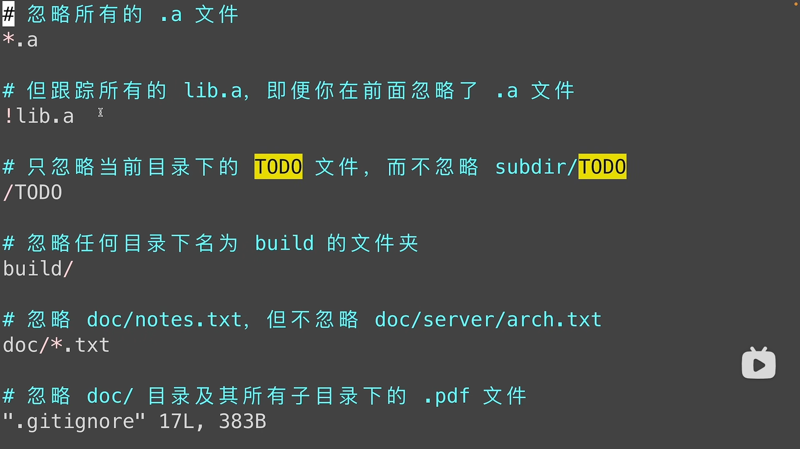

**---------------------Git Use Learn Note------------------------------**

# git学习-先修知识：
>**工作区：** 就是你电脑上的本地文件夹，类似本地生产车间   
>**缓存区：** 是git系统中的一个缓存概念，暂时存放库文件，类似于仓库运输车   
>**本地仓库：** 是git系统中的本地仓库，类似于工厂中存储仓库   

# 1. Config User name and User Email
    1. git config --global user.name "wls"  //conifg git user name wls
    2. git config --global user.email ufo281@outlook.com  //conifg git user email 


# 2. Creat Git Repositories
    1. git init //use this command init current directory to git Repositories
    /* 仓库文件都存放在了 当前目录下的.git文件里  */


# 3. Git 添加 提交 工作原理流程图

> 

> 

> 

    1. git add . //将当前目录下的所有文件都添加到暂存区中，然后可以使用git status 查看下当前的状态
**如下图所示**
> 

> 

    2. git commit -m "v1.0" //把暂存区中的文件提交到本地仓库中去，此操作并不会把工作区中的文件提交到本地仓库中去
> 


    3. git ls-files //查看暂存区中的文件有哪些 
**如下所示：**
```
wls@DESKTOP-S65BDJR:~/simple_c$ git ls-files
.vscode-ctags
.vscode/c_cpp_properties.json
c_example/1.0_user_printf/main.c
c_example/1.0_user_printf/simple_c.code-workspace
git_learn_note/git_learn_note.md
git_learn_note/image-1.png
git_learn_note/image-10.png
git_learn_note/image-11.png
git_learn_note/image-12.png
git_learn_note/image-2.png
git_learn_note/image-3.png
git_learn_note/image-4.png
git_learn_note/image-5.png
git_learn_note/image-6.png
git_learn_note/image-7.png
git_learn_note/image-8.png
git_learn_note/image-9.png
git_learn_note/image.png
git_learn_note/p1.png
simple_c.code-workspace
```

    git log //查看git commit的提交记录，就是从从暂存区提交到本地仓库的提交记录
**如下所示：**
```
wls@DESKTOP-S65BDJR:~/simple_c$ git log     /*使用git log命令 产看commit记录*/
commit a9c1c7e319674f6c6f72aec637b3783503a09de8 (HEAD -> master)
Author: wls <ufo281@outlook.com>
Date:   Fri Apr 26 19:25:17 2024 +0800 /*commit 时间记录*/

    add image-3.png     /*commit提交时候的备注*/

commit fbd6c1152ffba03d7577eea2d066e7da3d8d782a /*commit 记录*/
Author: wls <ufo281@outlook.com>
Date:   Fri Apr 26 19:23:21 2024 +0800  /*commit 时间记录*/

    v1.0   /*commit提交时候的备注*/
```
    4. git log --oneline //查看详细版的提交 commit 历史 
**如下所示：**
```
wls@DESKTOP-S65BDJR:~/simple_c$ git log --oneline 
faf6c7e (HEAD -> master) new
6352ab1 git_learn_note.md
a9c1c7e add image-3.png
fbd6c11 v1.0
```


# 4. Git 仓库状态查看
    1. git status  //查看仓库的修改状态 当前仓库处在什么分支，有哪些文件，文件处在什么状态，未添加的，添加的，未提交的，提交的


# 5. git reset 回退到某个版本

    1. git reset --soft 6352ab1 // "6352ab1" 要回退版本的ID 输入 git log --oneline 查看获得，/*soft 只是回退到上个版本到那时取消之前的commit 提交到本地仓库的东西 */

    2. git reset --hard HEAD^ //回退到上一个版本，把这个版本 git add到暂存区的东西，和git commit -m "xxx" 提交到本地仓库的东西都给删除了

    3. git reset HEAD^ //reset 默认为mixed，回退到上个版本后本次git add暂存区的东西会消失
> 


# 6. git diff

    1. git diff //不加参数，默认查看，工作区与暂存区之间的差异
>
---
    2. git diff HEAD //查看工作区与版本库之间的差异

    3. git diff --cached //查看暂存区与版本库之间的差异
---
    4. git diff f458228 e8177f7 //根据commit id 来比较两个版本之间的差异内容
**如下图**
>
---
    git diff HEAD~ HEAD //比较当前版本 HEAD表示当前版本，与上一个版本（HEAD^ / HEAD~表示）的的区别
    git diff HEAD~2 HEAD //比较当前版本 HEAD表示当前版本，与倒数第3个版本的区别
    git diff HEAD~3 HEAD //比较当前版本 HEAD表示当前版本，与倒数第4个版本的区别
    git diff HEAD~2 HEAD git_learn_note/git_learn_note.md //比较当前版本 HEAD表示当前版本，与倒数第3个版本的 git_learn_note/git_learn_note.md文件的 区别
    git diff master devlop //比较master分支与devlop分支的区别

>

# 7. git rm file 删除文件
**只能删除在缓存区中文件，然后再选择，是只在缓存区删除，还是再工作区也删除**

    1. git rm c_example/1.0_user_printf/main_copy.c //将文件c_example/1.0_user_printf/main_copy.c 从工作区中删除了，然后再暂存区也删除了

    2. git rm --cached c_example/1.0_user_printf/main_copy.c //将文件c_example/1.0_user_printf/main_copy.c 只把文件从暂存区中删除了，不删除工作区中的

    3. git rm -r * //删除目录中的所有文件

>

# 8. .gitignore文件

    1. .gitignore文件 是一个特殊的文件，其内容为禁止包含某些文件，上传到库中
>
>
>